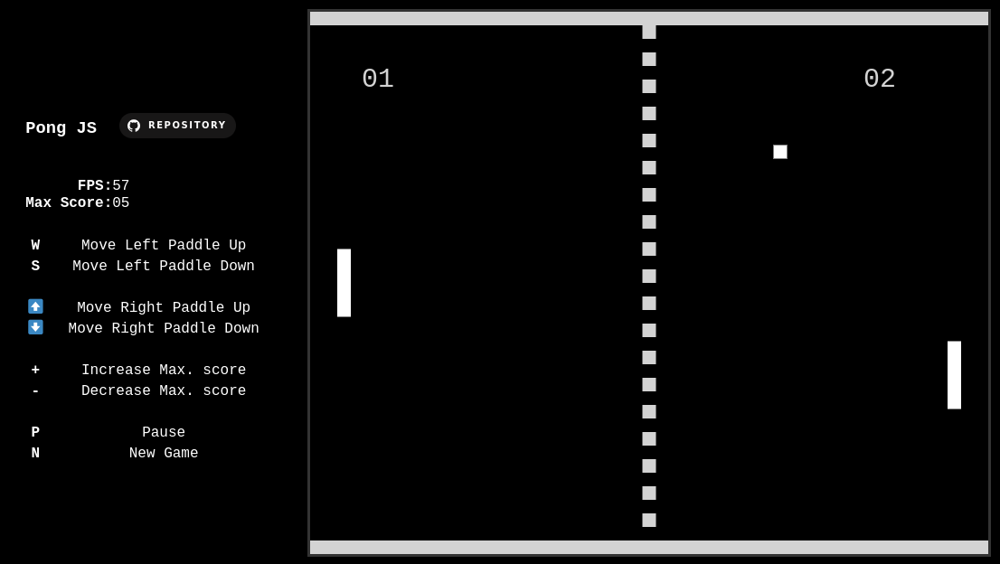
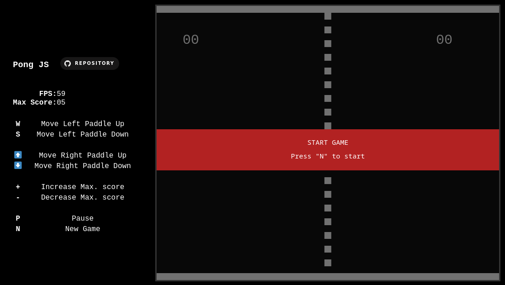
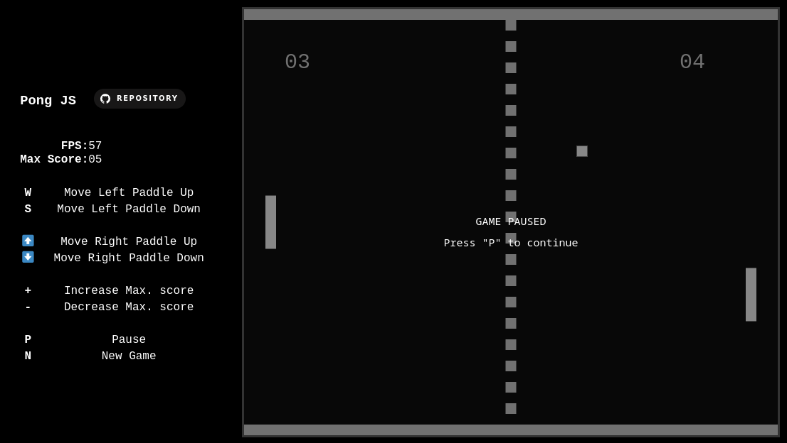
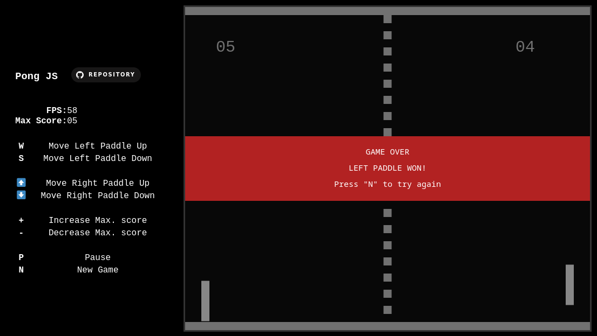

# GamesJS 🎮

- This open source repository contains a **collection of games** built on basic tech stacks in web development. 
- Use your creativity, build your own game and contribute to the repository by making a PR
- Make sure to ⭐️ the repository to stay tuned! 

# Pong

## Tech Stack ⚡

## Description 📃
> This game is developed by HTML, CSS and JS.
>
> Pong is a table tennis–themed twitch arcade sports video game, featuring simple two-dimensional graphics, manufactured by Atari and originally released in 1972.

## How to play? 🕹️

As you start the game, the ball starts moving in a random dyagonal direction, and then it works like a tennis games.

To win, each Player/Paddle needs to defend their own field and also needs to make a point in their opponent field. 

Once the Player/Paddle have reached the maximum score, the game is over.

Keys:
- *`W`* - **Move Left Paddle Up**
- *`S`* - **Move Left Paddle Down**
- ⬆️ *(Up Arrow Key)*- **Move Right Paddle Up**
- ⬇️ *(Down Arrow Key)* - **Move Right Paddle Down**
- `+` - **Increase Maximum Score**
- `-` - **Decrease Maximum Score**
- *`P`* - **Pause Game**
- *`N`* - **New Game**

## Screenshots 📸

|                                         |                                            |
|               :---:                     |                 :---:                      |
|   |  |
|  |        |

## Further Exploration 🔭

This are further exploration to add in the future, but feel free to implement it and/or give suggestion! 

> *Nothing to add... for now 😎*

## License 🪪

> (Apache License, Version 2.0) You're free to use this game and code in any project, personal or commercial. 
>
> There's no need to ask permission before using these. Giving attribution is not required, but appreciated.
