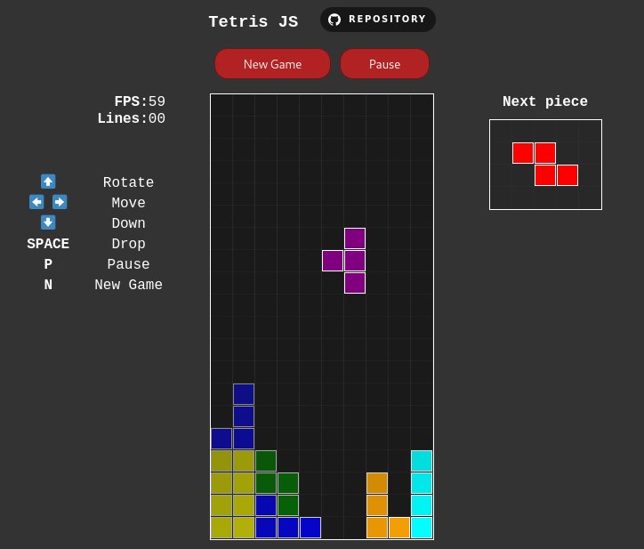

# GamesJS 🎮

- This open source repository contains a **collection of games** built on basic tech stacks in web development. 
- Use your creativity, build your own game and contribute to the repository by making a PR
- Make sure to ⭐️ the repository to stay tuned! 

# Tetris

Play demo <a href='https://miguelrolo.github.io/Repository/GamesJS/Tetris/'>here</a>

## Tech Stack ⚡

## Description 📃
> This game is developed by HTML, CSS and JS.
>
> Tetris is a puzzle video game created in 1985 by Alexey Pajitnov, a Soviet software engineer. 
>
> It has been published by several companies for multiple platforms, most prominently during a dispute over the appropriation of the rights in the late 1980s.

## How to play? 🕹️

As you start the game, the tetriminos will start to cascade down from the top of the grid and collect at the base. 

To win, you'll need to rotate the Tetriminos so they fit together perfectly and form rows that span the entire playing field. With each clear, the line disappears from the grid. 

Once the Tetriminos have climbed to the top of the grid, the game is over.

Keys:
- ⬆️ *(Up Arrow Key)*- **Rotate Piece**
- ⬅️ ➡️ *(Left/Right Arrow Key)* - **Move Piece**
- ⬇️ *(Down Arrow Key)* - **Move Down Piece**
- *`SPACE`* *(Space Bar)* - **Drop Piece**
- *`P`* - **Pause Game**
- *`N`* - **New Game**

## Screenshots 📸

|                                         |                                            |
|               :---:                     |                 :---:                      |
|   |  |
|  |        |

## Further Exploration 🔭

This are further exploration to add in the future, but feel free to implement it and/or give suggestion! 

- Shadow Piece
- Score
- Level
- Time

## License 🪪

> (Apache License, Version 2.0) You're free to use this game and code in any project, personal or commercial. 
>
> There's no need to ask permission before using these. Giving attribution is not required, but appreciated.
