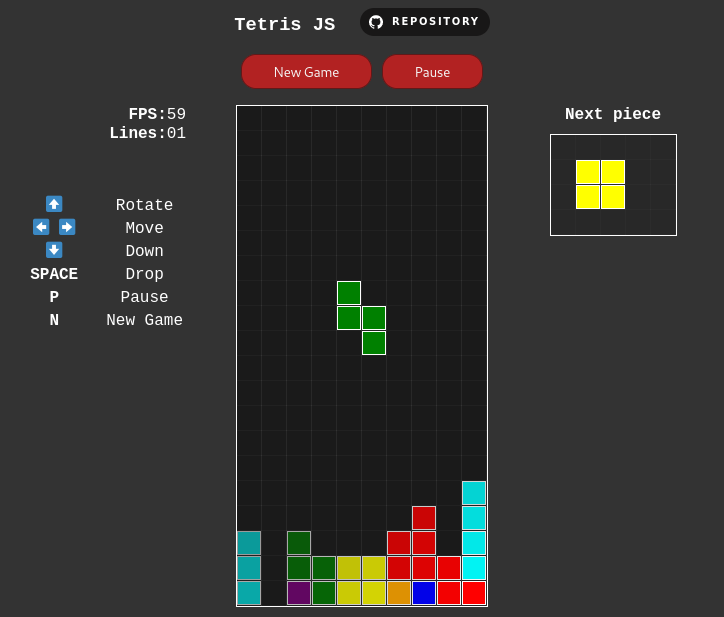
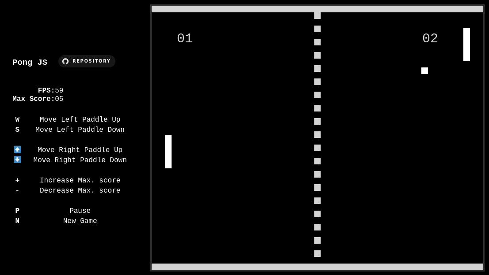

# GamesJS 🎮

- This open source repository contains a **collection of games** built on basic tech stacks in web development. 
- Use your creativity, build your own game and contribute to the repository by making a PR
- Make sure to ⭐️ the repository to stay tuned! 

## Games that you can find 🔭

Games in total: `2`

|                                         |                                            |
|               :---:                     |                 :---:                      |
|      |             |

*And <a href='https://github.com/MiguelRolo/GamesJS/tree/main/Games'>more</a>...*

## Why to Open Source 🌐

1. **Community Collaboration**: Open sourcing your project invites a global community of developers to contribute, share ideas, and enhance its capabilities.

2. **Accelerated Development**: With a collective effort, open source projects progress faster, benefiting from diverse skill sets and constant feedback.

3. **Transparency and Trust**: Open source builds trust by allowing users to inspect code, ensuring security and transparency in software.

4. **Cost Efficiency**: It reduces development costs as contributors volunteer their time and resources, making it an economical choice.

5. **Longevity**: Open source projects tend to have longer lifespans, as they are not reliant on a single entity, ensuring sustainability.

## Tech Stack ⚡

Most of the games are **Client-Side based** coded wiht **HTML5**, **CSS3** and **JS**


## Installation 📥

> Install GameJS Repository with npm
>
> *(This will install all files, including all games and this README.md)*
>
> ```bash
>  npm install https://github.com/MiguelRolo/GamesJS.git
>  cd GamesJs
> ```

## License 🪪

> (Apache License, Version 2.0) You're free to use this games and codes in any project, personal or commercial. 
>
> There's no need to ask permission before using theses. Giving attribution is not required, but appreciated.

## Games List 🤖
Games in total: `2`

| No.     | Name of the game |
| :---:   | ---- |
| 1       | <a href='https://github.com/MiguelRolo/GamesJS/tree/main/Games/Pong'>Pong</a>  |
| 2       | <a href='https://github.com/MiguelRolo/GamesJS/tree/main/Games/Tetris'>Tetris</a>  |
